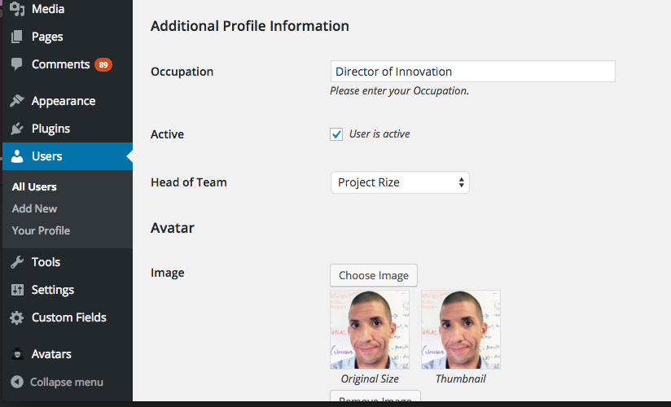

The following notes summarize the majority of the behavioral customizations we made to WordPress in the process of developing our theme.

## Custom Pages

**Page-CustomHome**

This drives the homepage which has:

* Site introduction - a post categorized as "Site Introduction"

* Projects - most recent 3 posts categorized "Project"

* Recent Posts - most recent 3 posts NOT categorized  "project"

* Teams - 5 categories whose IDs are entered into "*Featured Category IDs"* in General Settings.  Their description comes from the category description.


Enter category IDs to control the teams on the homepage


Author bio includes additional profile information:
*   Occupation - shows up on project detail page
*   Active - determines whether the show on staff page
*   Head of Team - select one head for each team


**Page-Projects**

* Landing page for projects.

* Queries the DB for all items categorized Project and shows latest 10

**Page-Fuego**

* Called "Trending" on the front end

* Queries our [openfuego](https://github.com/niemanlab/openfuego) database and shows the latest items.

**Page-Staff**

* Shows all users that have "User is Active" checked

**Page-Team**

The landing page for a single team that includes:

* The team name + description (from category data)

* The team lead (from ‘head of team’ field on authors)

* Recent blog posts by the team (all posts categorized with the team’s category but not project)

* Projects by the team (all post categorized as team + project)

**Page-Teams**

* A landing page that shows all of our teams

* Driven by same Featured Category IDs as homepage

## Custom Data

**Selected Teams on Homepage** - These are driven by a general site setting called Featured Category IDs

**Team Description** - The description for a team comes from the category description

**Team Head** - The head of a team is selected by navigating to a user’s page and selecting a value from the ‘is head of team’ dropdown

**Assigning Users to Projects** - There is a users_in_project custom field attached to a given post that contains userIDs that contributed.  The right side will show the user and their occupation


## Custom Shortcodes

**[tagline]** Adds a line of text which references and links to the Innovation Series blog

##Plugins

The purpose of this doc is to summarize the plugins we have installed and what they’re for.

### Advanced Custom Fields

Link: [https://wordpress.org/plugins/advanced-custom-fields/](https://wordpress.org/plugins/advanced-custom-fields/)

The advanced custom fields plugin makes it easy to attach custom fields to posts.  We currently have one custom field that is used this way

* "Hide Featured Image" - Hides the featured image in the post detail page but it still gets used in listing pages


### WP User Avatar

Link: [https://wordpress.org/plugins/wp-user-avatar/](https://wordpress.org/plugins/wp-user-avatar/)

By default WP doesn’t let you set avatars for users (they are managed by gravatar).  We needed the ability to set them outside of gravatar and this plugin gets the job done.

### Google Analytics by Yoast

Link: [https://wordpress.org/plugins/google-analytics-for-wordpress/] (https://wordpress.org/plugins/google-analytics-for-wordpress/)

This plugin by Yoast has over a million downloads. It lets you pick between authenticating your Google Account or manually entering your account ID.  If you authenticate your account, you can view reports from within the Wordpress Admin area.

### WP Embed Facebook

Link: [https://wordpress.org/plugins/wp-embed-facebook/] (https://wordpress.org/plugins/wp-embed-facebook/)

Facebook Video embeds aren't a simple iFrame - instead, they require some markup as well as Javascript.  This plugin makes the embed as simple as pasting the URL into either the visual or text editor and it automatically shows a preview in the visual view.

### Mail From

Link: [https://wordpress.org/plugins/mail-from/] (https://wordpress.org/plugins/mail-from/)

The Mail From plugin allows admins to change the 'from' value in the emails - instead of being hardcoded to the address of "wordpress@innovation.bbg.gov" and a from name of "WordPress" we can set it to whatever we like.

### Google XML Sitemaps
Link: [https://wordpress.org/plugins/google-sitemap-generator/] (https://wordpress.org/plugins/google-sitemap-generator/)
Generates a sitemap for Google.

##Helpful Snippets

###Auto-clear FB Open Graph cache on post update

Facebook sometimes caches the featured image and text that will show when a user shares a URL of a Wordpress post.  This snippet clears that cache when a user publishes or updates the post.

```php
/* ODDI CUSTOM: Clear FB Cache when someone updates or publishes a post */
function clearFBCache( $post_ID, $post) {
	$urlToClear = get_permalink($post_ID);
	$ch = curl_init();
	curl_setopt ($ch, CURLOPT_URL,"https://graph.facebook.com");
	curl_setopt ($ch, CURLOPT_POST, 1);
	curl_setopt ($ch, CURLOPT_POSTFIELDS, http_build_query(array('scrape' => 'true','id' => $urlToClear)));
	curl_exec ($ch);
	curl_close ($ch);
	
}
add_action( 'publish_post', 'clearFBCache', 10, 2 );
```
